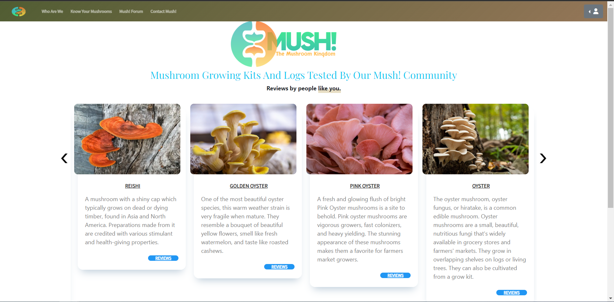
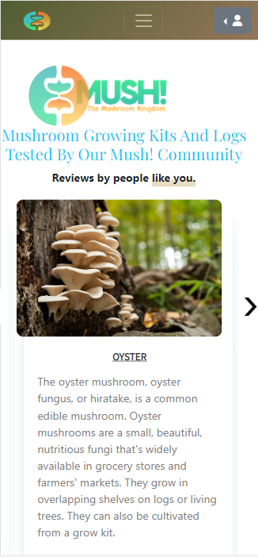
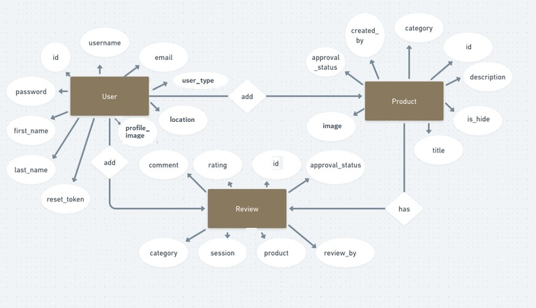
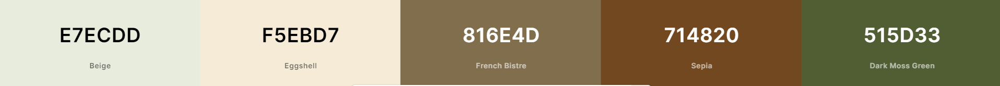
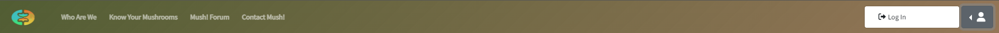
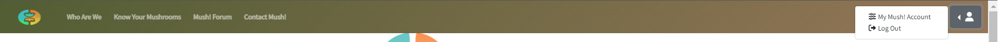

    # Reviewer  

    
    

    [Live application can be found here](https://mushcommunity-app.herokuapp.com/)

    This is a full-stack framework project built using Python, Django, JavaScript, HTML and CSS. This is a mushroom community website designed to display reviews to mushroom fanatics and allow them to make reviews. This project has been built for educational purposes.

    ---
    ## UX

    ## Strategy
    Using the core UX principles I first started with Strategy, thinking about the target audience for this community app and the features they would benefit from.

    The target audience for 'Mush!App' are:
    - Average age group 38 years old
    - People that would like to know more about fungi
    - People that enjoy growing mushroom kits

    These users will be looking for:
    - An informative website, with information that is easy-to-find & concise
    - Reviews, with essential information such as knowledge level, location and growing method
    - A form to write a review
    - A way to contact the admin
    - The ability to make a user account to edit their account

    This website will offer all of these things whilst also allowing for intuitive navigation and comfortability of use. 

    Due to the age group of the users, it is assumed that most users will be viewing the site on their mobile phones and therefore creating something responsive is integral to the design, I have used Bootstrap grids and elements & custom CSS to allow for this.

    ## User Stories
    Please find all my defined user stories & their acceptance criteria [here](https://github.com/cgauci87/mushapp/issues)

    1. As a user I can simply navigate through the site so that I can view desired content.
    2. As a user, I can get key information about mushrooms from the landing page.
    3. As an admin user, I can log in so that I can access the site's admin pages.
    4. As an admin user, I can approve or reject any incoming reviews so that I can manage the reviews section efficiently.
    5. As an admin user, I can sign in to add & remove products from the carousel so that I can make sure the website is up to date and accurately reflects what is being displayed.
    6. As an admin user, I can create, remove, update or delete carousel items from the database so that I can ensure items are accurate and able to be added to the carousel on the site.
    7. As a user, I can log in or register so that I can write reviews.
    8. As a user, I can easily see if I'm logged in or not so that I can choose to log in or log out depending on what I'm doing.
    9. As a user, I can edit my existing account so that I change my account user details.
    10. As a user, if logged in I can see an auto-populated form with my account details.
    11. As a user, I can see reviews separately so that I will be able to easily find the information.
    12. All reviews contain key details and content.
    13. As a user, I can see a review dashboard to get an overview of the overall ratings of a mushroom variety type.
    14. As an admin user, I can view and manage messages which have been sent from the contact-us form.
    15. As a user, I can find a navigation bar and footer so that I can see what content there is on the website.
    16. As a user, I can send a contact form to the admin so that I can send any general queries.
    17. As a logged-in Admin, I can delete an existing review or incoming message.

    ## Scope
    In order to achieve the desired user & community goals, the following features will be included in this release:

    - Responsive navbar that will navigate to the various pages throughout the site
    - Landing page with information about the community and links to the reviews
    - Who Are We page, provide description about the community
    - Know Your Mushrooms page, with knowledge about popular mushrooms.
    - Register/login feature using JWT Authentication with Django REST Framework.
    - Contact form that sends an email using Gmail SMTP

    ## Structure
    This website has been designed with simplicity in mind, each page only has key information on it so that the user can find what they want quickly without having to read through unnecessary things. I have separated each key feature to highlight its functionality to the user.

    The website is made of three apps:

    1. Website - core functionality
    2. Products - product management and display
    3. Users - user management

    ### Databases

    All apps require databases to store information so I have built 7 custom models.

    #### Products
    There are total of 4 models in Products:

    Product & ProductReview are the model names for the Products app which have custom fields along with generic fields inherited from baselayer.basemodels using LogsMixin.

    ProductApprovalStatusChoices & ProductReviewApprovalStatusChoices are the model names for the Products app which are focused on choices based on admin decision - Each product/review has either PENDING or APPROVED or REJECTED. According to the decision made by the Admin, the product/review will be either (hidden from being displayed to users) or approved which will be displayed to users or otherwise rejected which means the product/review will be deleted. These models use "models.TextChoices" which is built-in.

    #### Users
    There are total of 3 models in Users:

    User & ContactUs are the model names for the Users app which have custom fields along with generic fields inherited from baselayer.basemodels using LogsMixin.
    AbstractUser class has been used, inherits the User class and was able to add additional fields required for the User in the database itself such as user_type,  location, profile_image and reset_password_token. To generate access token, it inherits from baselayer.baseauthentication which has custom JWT authentication for both user types - User and Admin.

    The UserTypeChoices model is being used to define user types; Admin and User.

    Entity Relationship Diagram below to see how the models relate to each other: 

    

    ### Color Palette

    

    ---
    ## Features

    ### Home page
    **Navigation bar**: The navigation bar has links to all the active pages for the user and are clearly labelled.

    If the user is logged in then the right side of the menu shows links for pages that only authorised users can visit & use, they are: 'My Mush! Account' & 'Logout'. Otherwise, the user will be given the option to 'Login'. This change in the menu ensures users are directed to pages they can use and preventing any frustration. Furthermore, it makes it abundantly clear what the logged-in status is to the user.

    
    ss